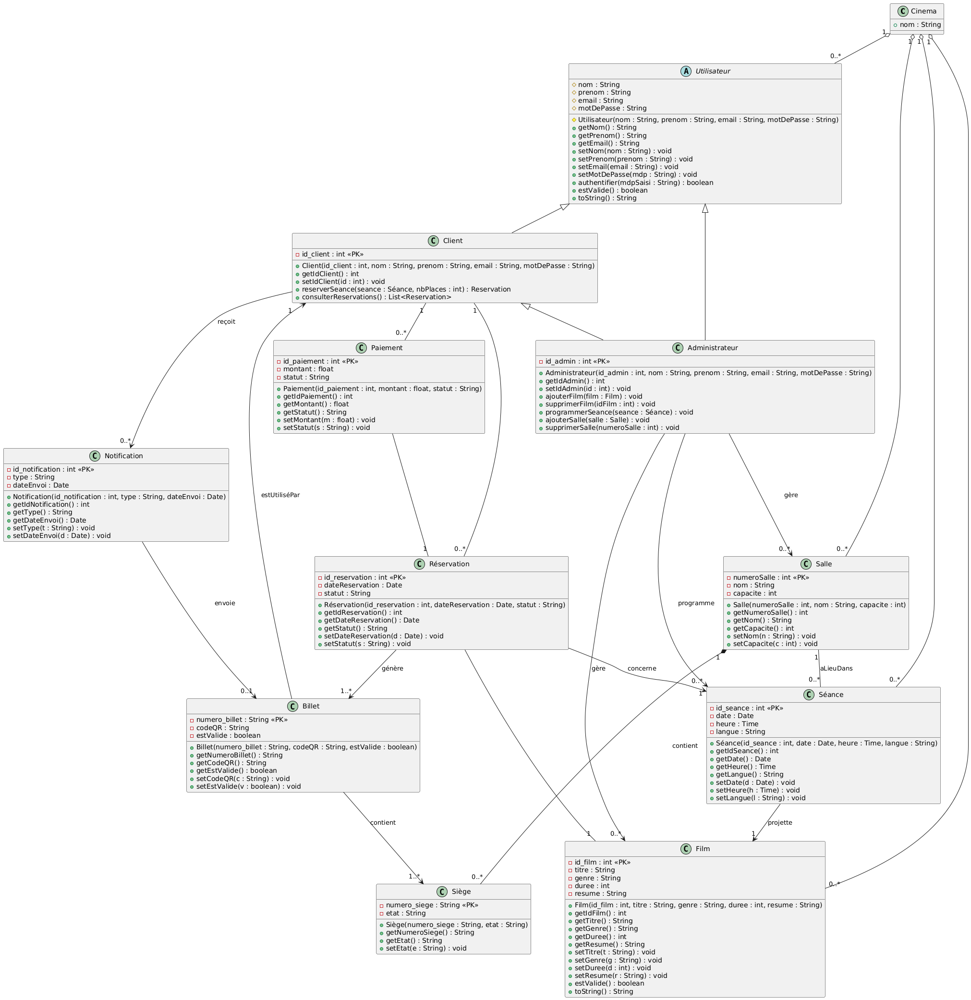
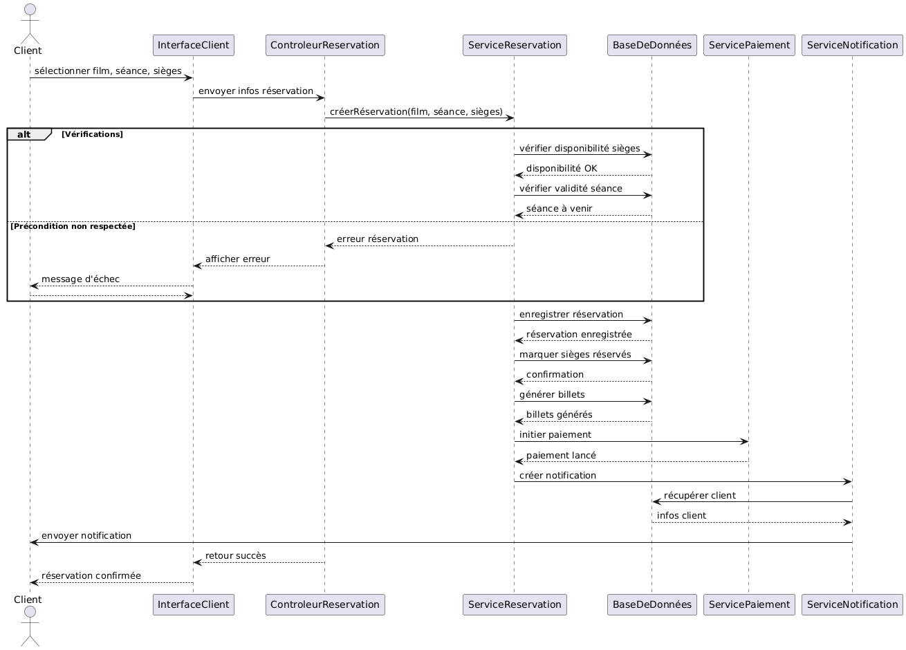
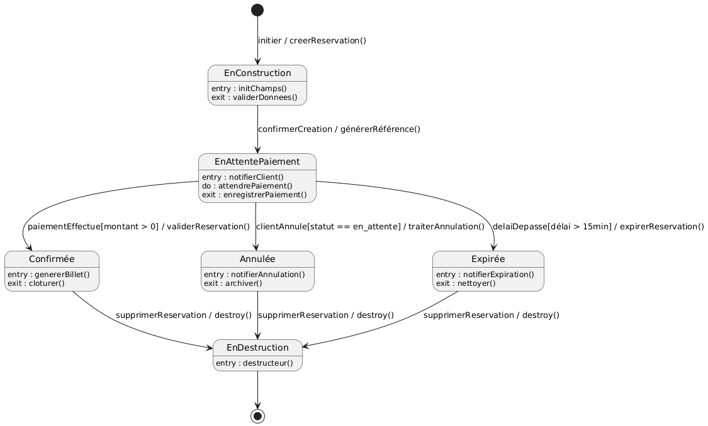

# 🎟️ Online Cinema Ticketing System (Multi-Hall) – UML Project

**Authors:**  
- Mohamed Yassine Abdi  
- Youssef Barbouch  
- Mohamed Ali Ben Alaya  

**Date:** 02/04/2025

---

## 📌 Project Introduction
This project aims to develop an **online cinema ticketing platform** for multi-hall cinemas. The system allows users to book tickets and manage reservations easily, reducing queues and optimizing cinema session management.  
It covers **movie, hall, session management**, and **secure online payments**. The project highlights **UML modeling**, object-oriented design, and system analysis skills.

---
## 🛠️ Tools and Methodologies Used
- **UML Diagrams:** Use Case, Class, Sequence, and State diagrams  
- **Project Specification & Design Techniques:**  
  - Requirements analysis  
  - Decision tables  
  - Object lifecycle modeling  
  - Sequence-to-algorithm translation  
- **Software Modeling Approach:**  
  - Object-Oriented Analysis and Design (OOAD)  
  - Refinement of UML diagrams to align with programming structures  
  - Aggregation, Composition, and Associations implemented conceptually  
- **Technologies Referenced:**  
  - Conceptual Java classes for entities  
  - Mockup of GUI workflows (Java Swing referenced in design)  
  - Database schema considerations (MySQL)

This project is **educational**, focusing on system specification and design rather than full implementation.

---

## 📝 Project Specification
The system must provide:

- **User-friendly experience:** intuitive interface for customers to book tickets.  
- **Admin functionalities:** manage movies, halls, and sessions.  
- **Real-time seat availability:** dynamic updates for reservations.  
- **Secure transactions:** safe online payments.  
- **Notifications:** email confirmation and reminders for sessions.

---

## 👥 Actors & Features

### 1. Customer
- Create an account and log in.  
- Browse and search movies with filters (genre, duration, etc.).  
- Book seats for a selected session (choose hall, number of seats, and seat positions).  
- Make secure online payments.  
- Cancel reservations.  
- Add movies to a personal "Watchlist".

### 2. Administrator
- Add, assign, or remove movies from halls according to schedules.  
- Manage halls (add/remove) and seating capacity.  
- Update seat availability after reservations or cancellations.

### 3. Payment System
- Process payments and validate transactions.  
- Handle refunds in case of cancellation.

### 4. Notification System
- Send confirmation emails to users.  
- Send reminders before movie sessions.

---

## 📊 Use Case Diagram

**Prioritized Use Cases for Sprint 1:**  
- "Add a Movie to the Collection" – main admin functionality  
- "Book a Movie" – main customer functionality  

---

## 📑 Decision Tables

### Add a Movie to the Collection

**Preconditions:**  
- Movie title is valid (not null/empty)  
- Duration is specified  
- Genre is specified  
- Director is specified  
- Movie code is unique  

**Postconditions:**  
- Movie is successfully added  

| Feature / Condition                       | 1  | 2  | 3  | 4  | 5  |
|-------------------------------------------|----|----|----|----|----|
| Title valid                               | F  | T  | T  | T  | T  |
| Duration specified                         |    | F  | T  | T  | T  |
| Genre specified                            |    |    | F  | T  | T  |
| Director specified                         |    |    |    | F  | T  |
| Movie code unique                          |    |    |    |    | T  |
| Movie added                                | F  | F  | F  | F  | T  |

---

### Book a Movie

**Preconditions:**  
- Customer is authenticated  
- Selected movie exists and is scheduled  
- Chosen session is upcoming  
- Seats are available  

**Postconditions:**  
- Reservation is recorded  
- Seats marked as reserved  
- Tickets generated  
- Notification sent to customer  
- Payment initiated or ready  

| Feature / Condition                       | 1  | 2  | 3  | 4  | 5  |
|-------------------------------------------|----|----|----|----|----|
| Customer authenticated                     | F  | T  | T  | T  | T  |
| Movie exists and scheduled                 | —  | F  | T  | T  | T  |
| Session is upcoming                        | —  | —  | F  | T  | T  |
| Seats available                            | —  | —  | —  | F  | T  |
| Reservation recorded                        | F  | F  | F  | F  | T  |
| Seats reserved                             | F  | F  | F  | F  | T  |
| Tickets generated                           | F  | F  | F  | F  | T  |
| Notification sent                           | F  | F  | F  | F  | T  |
| Payment initiated or ready                  | F  | F  | F  | F  | T  |

---

## 🏗️ Preliminary Design

### 1. Class List

| Class               | Main Attributes                                | Notes / Associations                                      |
|--------------------|-----------------------------------------------|-----------------------------------------------------------|
| Cinema              | name                                          | Aggregates movies, halls, sessions, users               |
| User                | name, surname, email, password                | Abstract class                                           |
| Customer            | id_client                                     | Inherits User                                            |
| Administrator       | id_admin                                      | Inherits User and Customer                               |
| Movie               | id_movie, title, genre, duration, summary    | Linked to sessions, managed by Admin                    |
| Reservation         | id_reservation, date, status                  | Linked to Customer, Movie, Session, generates Tickets   |
| Payment             | id_payment, amount, status                     | Linked to Reservation                                    |
| Hall                | hall_number, name, capacity                    | Contains Seats                                           |
| Session             | id_session, date, time, language              | Links Movie and Hall                                     |
| Ticket              | ticket_number, QR_code, isValid               | Generated from Reservation, linked to Customer          |
| Seat                | seat_number, status                            | Linked to Hall and Ticket                                |
| Notification        | id_notification, type, sentDate               | Linked to Ticket                                         |

### Class Diagram (Initial)

---

## 🔄 Sequence Diagrams

### DSUC1: Add a Movie

### DSUC2: Book a Movie

---

## 🟢 State Diagrams

### Reservation Life Cycle

**States:**  
- InConstruction  
- PendingPayment  
- Confirmed  
- Cancelled  
- Expired  
- Destroyed  

---

## 💻 UML Refinements

- Associations translated into class attributes (`1..*` → `List<...>`).  
- Aggregation and composition applied with object lifecycle in mind.  
- Sequence and state diagrams translated into natural-language algorithms.

### Refined Class Diagram
.png)

### Refined Sequence Diagrams
- DSUC1: .png)  
- DSUC2: .png)

### Refined State Diagram
.png)
